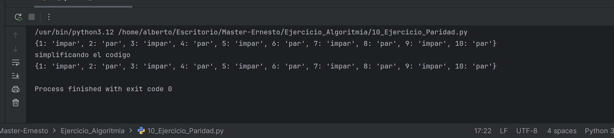

# Clasificador de Paridad con Diccionarios en Python
Descripción del Proyecto
- Este repositorio contiene un diseñado para demostrar de manera efectiva el uso de diccionarios como una poderosa estructura de datos para categorizar y organizar información. 
- El programa procesa una secuencia de números y los clasifica según su paridad (si son pares o impares), almacenando el resultado de forma clara y accesible en un diccionario.
- Es un excelente ejemplo para entender la manipulación y organización de datos en Python.

## Características Principales
- Clasificación de Números: Identifica si cada número de una lista o secuencia es par o impar.

- Uso Estratégico de Diccionarios: Organiza los números clasificados en un diccionario, donde las claves pueden ser 'pares' e 'impares' y los valores, listas de los números correspondientes.

- Demostración de Lógica Condicional: Utiliza operadores de módulo para determinar la paridad de forma eficiente.

## Impresion del resultado

